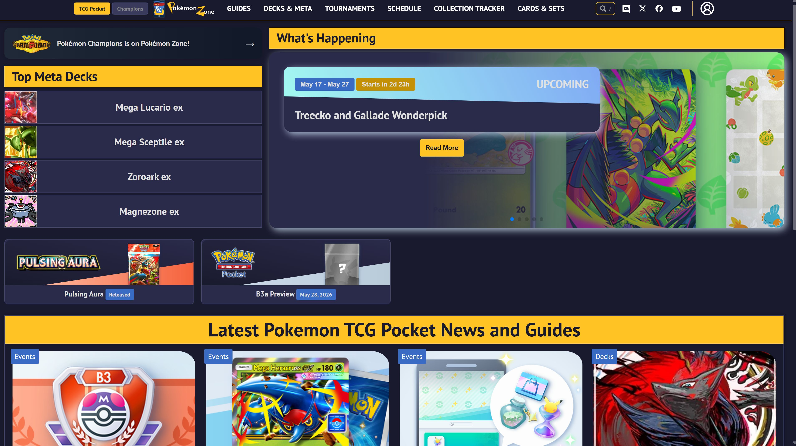
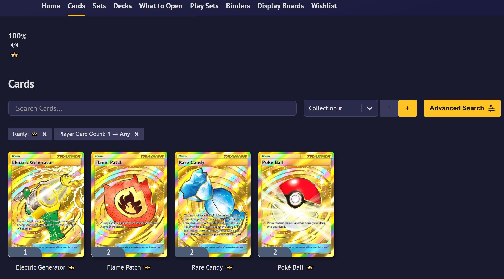
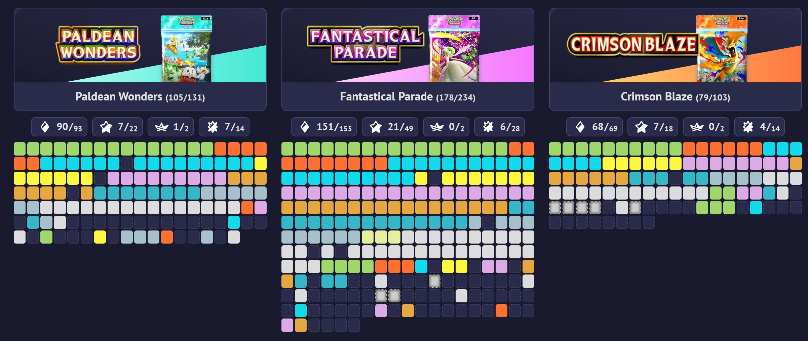
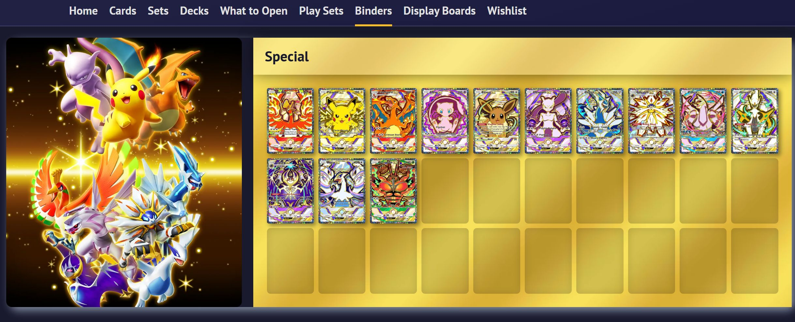

# Pokemon-zone.com UI Tweaks

Gives [pokemon-zone.com](https://www.pokemon-zone.com) a dark navy theme, full-width layout, and redesigned UI.

## Features

- Dark navy theme across both TCG Pocket and Champions sections
- TCG Pocket / Champions toggle in the main toolbar
- Full-width layout, no sidebar, content fills the screen
- Redesigned binder pages with cover art and card grid side by side
- Improved grids for articles, events, sets, and trade search
- Dark profile pages with themed trophies, currencies, rarity bars, and set cards

## Install

1. Install [Tampermonkey](https://www.tampermonkey.net/) or [Violentmonkey](https://violentmonkey.github.io/)
2. Install from [Greasy Fork](https://greasyfork.org/en/scripts/578058-pokemon-zone-com-ui-tweaks)
3. Visit [pokemon-zone.com](https://www.pokemon-zone.com) and enjoy

## License

[MIT](LICENSE)

## Preview

